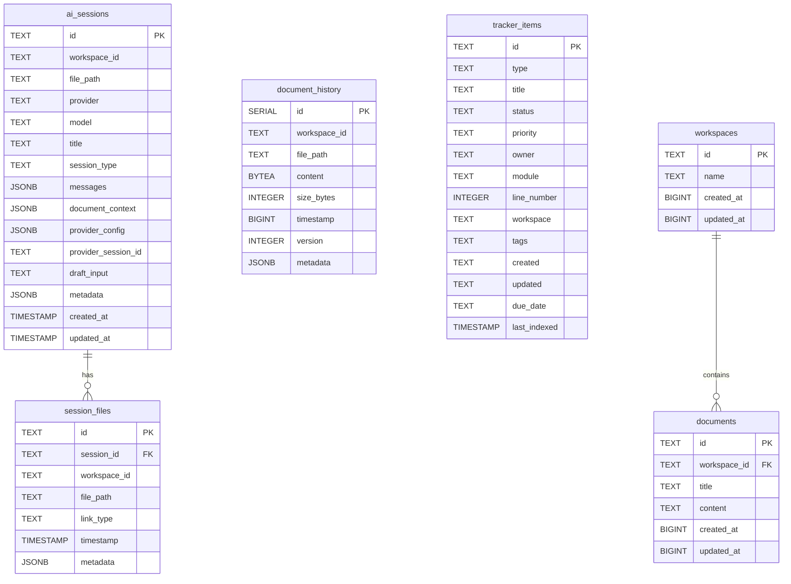

# Database Schema Documentation

{911x570}

## Overview

Nimbalyst uses **PGLite** (PostgreSQL in WebAssembly) for all data persistence. The database runs in a Node.js worker thread and provides a robust, ACID-compliant storage system for the application.

**Database Location**: `~/Library/Application Support/@nimbalyst/electron/pglite-db/` (macOS)

## Entity-Relationship Diagram

## Table Descriptions

### ai_sessions

Stores AI chat conversation sessions with complete message history and provider configurations.

**Columns:**
- `id` (TEXT, PK): Unique session identifier
- `workspace_id` (TEXT): Associated workspace identifier
- `file_path` (TEXT): Optional file path associated with session
- `provider` (TEXT): AI provider name (claude, openai, claude-code, lmstudio)
- `model` (TEXT): AI model identifier
- `title` (TEXT): Human-readable session title
- `session_type` (TEXT): Structural type of session ('session', 'workstream', 'blitz')
- `parent_session_id` (TEXT, FK → ai_sessions.id, ON DELETE SET NULL): Parent session for workstream children. **Always `NULL` for worktree-resident sessions.**
- `worktree_id` (TEXT, FK → worktrees.id): Worktree this session lives in. **Always `NULL` on `session_type='workstream'` rows.**
- `document_context` (JSONB): Document context sent with messages
- `provider_config` (JSONB): Provider-specific configuration
- `provider_session_id` (TEXT): External provider session ID
- `draft_input` (TEXT): Unsent draft message
- `metadata` (JSONB): Additional metadata
- `created_at` (TIMESTAMP): Creation timestamp
- `updated_at` (TIMESTAMP): Last update timestamp

**Hierarchy rules — READ BEFORE WRITING CODE THAT CREATES SESSIONS:**
See [SESSION_HIERARCHY.md](./SESSION_HIERARCHY.md) for the authoritative two-layer invariant, the "worktree IS the workstream" rule, and the legal combinations of `session_type` / `parent_session_id` / `worktree_id`. Violating those rules silently breaks the left-pane grouping.

**Note:** Message history is now stored in the `ai_agent_messages` table, not as a JSONB column in this table.

**Indexes:**
- `idx_ai_sessions_workspace` on `workspace_id`
- `idx_ai_sessions_created` on `created_at`
- `idx_ai_sessions_type` on `session_type`

**Related Code:**
- Implementation: `packages/electron/src/main/services/PGLiteSessionStore.ts`
- Interface: `@nimbalyst/runtime` package

### session_files

Tracks file relationships with AI sessions (edited, referenced, or read files).

**Columns:**
- `id` (TEXT, PK): Unique link identifier
- `session_id` (TEXT, FK): Reference to ai_sessions
- `workspace_id` (TEXT): Associated workspace
- `file_path` (TEXT): Path to linked file
- `link_type` (TEXT): Type of relationship - CHECK constraint: 'edited', 'referenced', or 'read'
- `timestamp` (TIMESTAMP): When the link was created
- `metadata` (JSONB): Additional link metadata

**Indexes:**
- `idx_session_files_session` on `session_id`
- `idx_session_files_file` on `file_path`
- `idx_session_files_type` on `link_type`
- `idx_session_files_workspace` on `workspace_id`
- `idx_session_files_workspace_file` on `workspace_id, file_path`
- `idx_session_files_unique` on `session_id, file_path, link_type`

**Related Code:**
- Implementation: `packages/electron/src/main/services/PGLiteSessionFileStore.ts`
- Interface: `@nimbalyst/runtime` package

### document_history

Stores compressed document edit history with binary content storage.

**Columns:**
- `id` (SERIAL, PK): Auto-incrementing primary key
- `workspace_id` (TEXT): Associated workspace
- `file_path` (TEXT): Path to the document
- `content` (BYTEA): Compressed document content as binary data
- `size_bytes` (INTEGER): Size of content in bytes
- `timestamp` (BIGINT): Unix timestamp in milliseconds
- `version` (INTEGER): Document version number
- `metadata` (JSONB): Additional metadata

**Indexes:**
- `idx_history_workspace_file` on `workspace_id, file_path`
- `idx_history_timestamp` on `timestamp`

**Features:**
- Binary compression for efficient storage
- Version tracking for document history
- Bounded file reads (4KB) for metadata extraction

**Related Code:**
- Implementation: `packages/electron/src/main/services/PGLiteDocumentsRepository.ts`

### tracker_items

Stores task tracking items extracted from plan documents and code comments.

**Columns:**
- `id` (TEXT, PK): Unique item identifier
- `type` (TEXT): Item type (task, bug, feature, etc.)
- `title` (TEXT): Item title/description
- `status` (TEXT): Current status
- `priority` (TEXT): Priority level
- `owner` (TEXT): Assigned owner
- `module` (TEXT): Associated module/file
- `line_number` (INTEGER): Line number in source
- `workspace` (TEXT): Associated workspace
- `tags` (TEXT): Comma-separated tags
- `created` (TEXT): Creation date string
- `updated` (TEXT): Last update date string
- `due_date` (TEXT): Due date string
- `last_indexed` (TIMESTAMP): Last indexing timestamp

**Indexes:**
- `idx_tracker_items_type` on `type`
- `idx_tracker_items_status` on `status`
- `idx_tracker_items_module` on `module`
- `idx_tracker_items_workspace` on `workspace`
- `idx_tracker_items_priority` on `priority`

**Use Case:**
- Agentic planning system integration
- Task and bug tracking from markdown plan documents

### workspaces

Manages workspace metadata and organization.

**Columns:**
- `id` (TEXT, PK): Unique workspace identifier (format: `ws_<uuid>`)
- `name` (TEXT): Workspace display name
- `created_at` (BIGINT): Creation timestamp (milliseconds)
- `updated_at` (BIGINT): Last update timestamp (milliseconds)

**Related Code:**
- Implementation: `packages/electron/src/main/services/PGLiteWorkspaceRepository.ts`

### documents

Stores document content and metadata within workspaces.

**Columns:**
- `id` (TEXT, PK): Unique document identifier (format: `doc_<uuid>`)
- `workspace_id` (TEXT, FK): Reference to workspaces
- `title` (TEXT): Document title
- `content` (TEXT): Document content
- `created_at` (BIGINT): Creation timestamp (milliseconds)
- `updated_at` (BIGINT): Last update timestamp (milliseconds)

**Related Code:**
- Implementation: `packages/electron/src/main/services/PGLiteDocumentsRepository.ts`

## Database Architecture

### Worker Thread Isolation

The database runs in an isolated Node.js worker thread to prevent module conflicts with the main process.

**Implementation:**
- Worker: `packages/electron/src/main/database/worker.js`
- Main process interface: `packages/electron/src/main/database/PGLiteDatabaseWorker.ts`

### Migration System

The database includes an automatic migration system for schema evolution:

**Migration Features:**
- Automatic column renaming (e.g., `project_id` to `workspace_id`)
- Adding new columns with default values
- Index creation and updates
- Legacy data preservation during migrations

**Key Migrations:**
- `ai_sessions`: Added `session_type`, `metadata`
- Column renames: `project_id` → `workspace_id`, `recent_projects` → `recent_workspaces`

### Protocol Server

Optional PostgreSQL protocol server for external database access:

**Features:**
- TCP socket server on localhost (default port with auto-increment)
- PostgreSQL wire protocol compatibility
- Debug inspection capabilities
- On-demand activation

## Data Types

### JSONB Columns

Several tables use PostgreSQL's JSONB type for flexible, queryable JSON storage:

- `messages` in `ai_sessions`: Array of chat messages
- `document_context` in `ai_sessions`: Document state snapshot
- `provider_config` in `ai_sessions`: Provider-specific settings
- `metadata` in multiple tables: Extensible metadata fields

### BYTEA Columns

Binary data storage for compressed content:

- `content` in `document_history`: Compressed document snapshots

## Performance Considerations

### Indexing Strategy

The schema includes comprehensive indexing for common query patterns:

1. **Workspace-based queries**: Most tables indexed on `workspace_id`
2. **Time-based queries**: Timestamps indexed for chronological access
3. **File lookups**: Composite indexes on `workspace_id, file_path`
4. **Session relationships**: Indexed foreign keys for joins

### Compression

Document history uses binary compression (BYTEA) to minimize storage footprint while maintaining ACID compliance.

## Related Documentation

- **CLAUDE.md**: Project overview and development guidelines
- **Migration System**: See `packages/electron/src/main/database/worker.js` for migration implementation
- **Runtime Interfaces**: See `@nimbalyst/runtime` package for TypeScript interfaces
